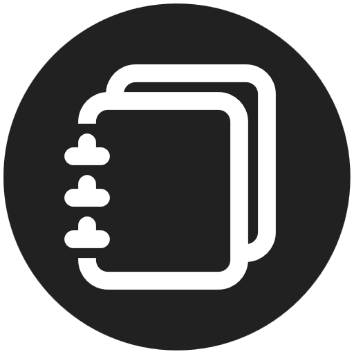
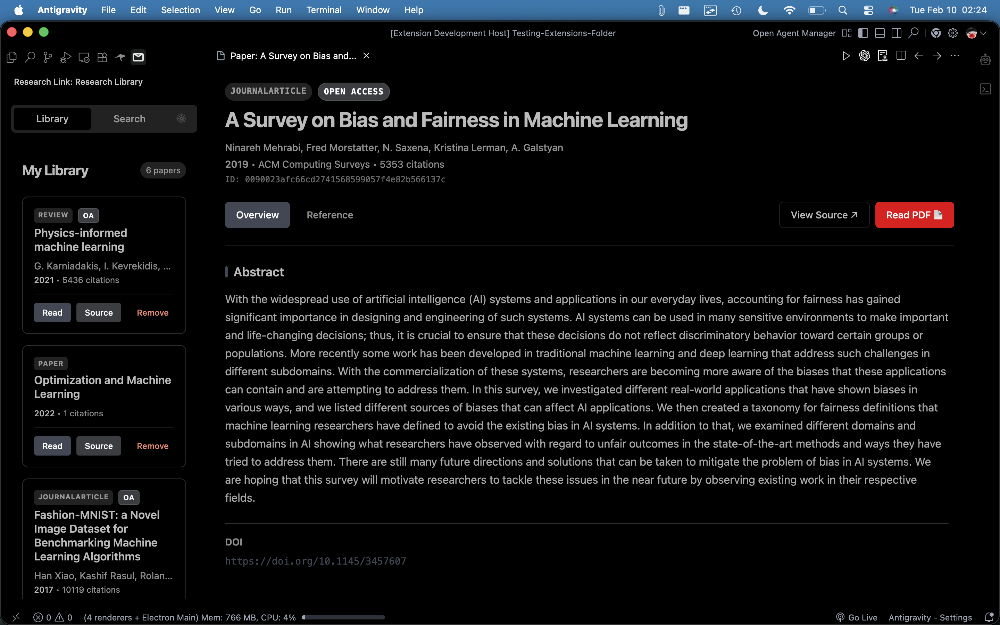

# Research Link

**Research Link** brings academic research directly into your VS Code workflow. Search, preview, manage, and cite papers from CrossRef and Semantic Scholar without leaving your editor.

## Features

- **Integrated Search**: Query millions of academic papers via CrossRef, Semantic Scholar, and OpenAlex, with smart deduplication to merge the best metadata from all sources.
- **Advanced Search**: Filter by Title, Author, Year, Venue, and DOI for precise results.
- **Enhanced Filtering**: Refine search results by specific year ranges, Open Access status, and publication type.
- **Selection Import**: Review multiple candidates when importing from ambiguous URLs/titles.
- **Personal Library**: Save papers to a local JSON-based library for quick access.
- **Reader View**: Read abstracts and metadata in a dedicated, distraction-free panel.
- **PDF Viewer**: View open-access PDFs directly in VS Code with page navigation and zoom controls.
- **Research Graph**: Visualise connections between saved papers with an interactive force-directed graph (edges from citations and shared authors).
- **Citation Generator**: Copy citations in APA, MLA, Harvard, or Chicago formats.
- **AI-Ready Workflow**: Export structured markdown files (`docs/*.md`) containing paper metadata and abstracts, optimized for RAG (Retrieval-Augmented Generation) and LLM context.
- **Visual Indicators**: Badges for Open Access status and Publication Type (Journal, Conference, Pre-print).

## Usage

1. **Open Sidebar**: Click the **Research Link** icon in the Activity Bar.
2. **Search**: Enter a query (e.g., "Transformers", "DOI:10.1038/s41586-020-2649-2") in the search bar.
3. **Save**: Click "Save to Library" on any result to add it to your personal collection.
4. **Read & Cite**:
      - Click "Read" on a saved paper to open the details panel.
      - Use the **Reference** tab to generate and copy citations.
      - Click **Generate AI Reference** to create a markdown file for your AI contexts.
5. **View PDFs**: Click **Read PDF 📄** on an open-access paper to view the PDF in-editor.
6. **Research Graph**: Click the **🕸️** button in the sidebar to visualise connections between your saved papers.

## Configuration

Research Link works out of the box. No API keys are required for basic usage.

## AI Integration

Research Link is designed to work alongside AI coding assistants. By generating structured markdown files of your research, you can easily provide context to your LLM:

1. Open a paper in Research Link.
2. Click **Generate AI Reference**.
3. A file is created in `docs/<DOI_or_ID>.md`.
4. Reference this file in your AI chat (e.g., `@docs/10.1038_s41586-020-2649-2.md`) to ask questions about the paper.

## Extension Settings

This extension contributes the following settings:

- `research-link.libraryPath`: (Optional) Custom path for the library JSON file.
- `research-link.importPdf`: (Optional) Automatically import PDFs when saving papers.
     - `research-link.importPdfPath`: (Optional) Custom path for the PDF files.
- `research-link.importUrl`: Automatically import URLs when saving papers.

## Known Issues

- Some PDFs may be behind paywalls or require authentication. Research Link will show a clear error in these cases.
- Rate limits apply to Semantic Scholar API requests.
- Some papers may not have abstracts available in either CrossRef, Semantic Scholar, or OpenAlex.

## Release Notes

- See [CHANGELOG.md](CHANGELOG.md) for release notes.
- See [Releases](https://github.com/JayNightmare/ResearchLink/releases) for release package.
- See [Issues](https://github.com/JayNightmare/ResearchLink/issues) for known issues.

---

**Enjoying Research Link?**
Please leave a review on the Marketplace!
